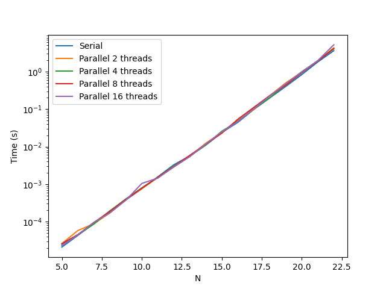

# Lab 2. Open MP
The lab was run on windows 10, Intel Core i5-9300H CPU @ 2.40GHz, 4 cores, 8 logical processors


## Bubble sort

Implemented 2 versions of bubble sort - sequential and parallel.

Sequential:

```c
void sequential_bubble_sort (uint64_t *T, const uint64_t size)
{
	size_t n_swaps = 1;
    for (uint64_t i = 0; i < size && n_swaps; i++) {
		n_swaps = 0;
		for (uint64_t j = 1; j < size; j++) {
			if (T[j - 1] > T[j]) {
				swap(&T[j - 1], &T[j]);
				n_swaps++;
			}
		}
	}
    
    return;
}
```

Parallel version implements the proposed algorithm.

We create threads in the begining, then each of them sorts its own chunks and then, after synchronization manages the left border.

```c
void parallel_bubble_sort (uint64_t *T, const uint64_t size)
{
    const uint64_t N_CHUNKS = omp_get_max_threads();
	omp_set_num_threads(N_CHUNKS);
	const uint64_t CHUNK_SIZE = size / N_CHUNKS;
	bool sorted = 0;

	#pragma omp parallel
	{
		int num_thread = omp_get_thread_num();

		for (uint64_t i = 0; !sorted; i++) {
			sequential_bubble_sort(T + num_thread * CHUNK_SIZE, CHUNK_SIZE);
			#pragma omp barrier

			sorted = 1;

			#pragma omp barrier
			if (num_thread > 0 && T[num_thread * CHUNK_SIZE - 1] > T[num_thread * CHUNK_SIZE]) {
				swap(&T[num_thread * CHUNK_SIZE - 1], &T[num_thread * CHUNK_SIZE]);
				sorted = 0;
			}
			#pragma omp barrier
		}
	}
	
    
    return;
}
```


However the parallel version fails to outrun the sequential, probably because thread creation and synchronization takes too much time.

## Merge sort

Sequential merge sort was done in recursive approach


```c
void sequential_merge_sort(uint64_t *T, const uint64_t size) {
    if (size <= 1)
        return;

    uint64_t middle = size / 2;

    sequential_merge_sort(T, middle);
    sequential_merge_sort(T + middle, size - middle);

    merge(T, middle);
}
```

Parallelization with omp tasks:

```c
void parallel_merge_sort(uint64_t *T, const uint64_t size) {
    if (size <= 1)
        return;

    uint64_t middle = size / 2;

	#pragma omp task 
    parallel_merge_sort(T, middle);
	#pragma omp task 
    parallel_merge_sort(T + middle, size - middle);

	#pragma omp taskwait
    merge(T, middle);
}
```


Again, the parallel version gives no improvement.

We can notice that we create tasks on each step on recursion, however, we can take benefit only from limited number of threads. So it makes sence to create tasks only on first steps of recursion, before we reach the limit of useful threads.

For this we introduce the level of recursion, on each we have *2^n* parallel tasks.

On my machine I have 8 cores, so the level limit is 2.

```c
void parallel_merge_sort_leveled(uint64_t *T, const uint64_t size, uint64_t level) {
	
    if (size <= 1)
        return;

    uint64_t middle = size / 2;

	if (level <= 2) {
		#pragma omp task 
		parallel_merge_sort_leveled(T, middle, level + 1);

		#pragma omp task
		parallel_merge_sort_leveled(T + middle, size - middle, level + 1);

		#pragma omp taskwait
		merge(T, middle);
	} else {
		parallel_merge_sort_leveled(T, middle, level + 1);

		parallel_merge_sort_leveled(T + middle, size - middle, level + 1);

		merge(T, middle);
	}	
}
```


However this implementation has no effect on performance.

## Odd-even sort

Sequential implementation

```c
void sequential_oddeven_sort (uint64_t *T, const uint64_t size)
{
	bool sorted = 0;
    while (!sorted) {
		sorted = 1;
		for (uint64_t i = 1; i < size; i+=2) {
			if (T[i - 1] > T[i]) {
				swap(&T[i - 1], &T[i]);
				sorted = 0;
			}
		}

		for (uint64_t i = 2; i < size; i+=2) {
			if (T[i - 1] > T[i]) {
				swap(&T[i - 1], &T[i]);
				sorted = 0;
			}
		}
	}

    return ;
}
```

For parallel version we can simply parallelize over for-loops which is why this is better then in bubble sort. We dont't need to split array into chunks and then handle their intersection, instead we achieve quite natural parallelization of a problem.

```c
void parallel_oddeven_sort (uint64_t *T, const uint64_t size)
{
	bool sorted = 0;
    while (!sorted) {
		sorted = 1;
		#pragma omp parallel for
		for (uint64_t i = 1; i < size; i+=2) {
			if (T[i - 1] > T[i]) {
				swap(&T[i - 1], &T[i]);
				sorted = 0;
			}
		}

		#pragma omp parallel for
		for (uint64_t i = 2; i < size; i+=2) {
			if (T[i - 1] > T[i]) {
				swap(&T[i - 1], &T[i]);
				sorted = 0;
			}
		}
	}

    return ;
}
```


On the graph we can clearly see that at some moment time of serial algorithm is growing faster then the time of parallel, so we can suppose that once the parallel time may be better than serial. However I was not able to compute on sizes more than *2^14*
